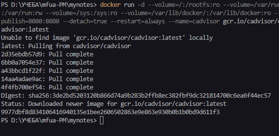
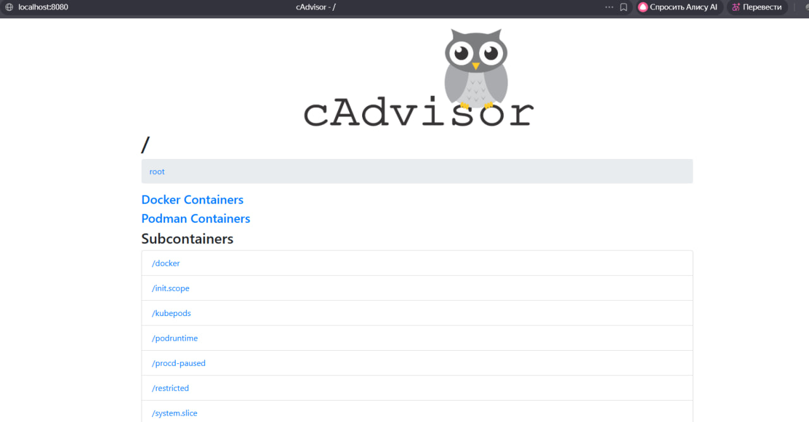

## cAdvisor (мониторинг контейнеров)

1. Мониторинг Docker контейнеров

> Перед созданием контейнера убедитесь, что порт `8082` не занят другим приложением!

> Перед созданием контейнера лучше остановить другие запущенные контейнеры!

Проверить порт `8080` для **Linux/Mac/WSL**:
```shell
# Проверьте, занят ли порт
netstat -tuln | grep :8080
```
> Если эта команда ничего не возвращает, то порт свободен

Проверить порт `8082` для **Windows**:
```shell
netstat -aon | findstr :8080
```


Загрузка, создание и запуск контейнера с cAdvisor:
```shell
docker run \
  --volume=/:/rootfs:ro \
  --volume=/var/run:/var/run:rw \
  --volume=/sys:/sys:ro \
  --volume=/var/lib/docker/:/var/lib/docker:ro \
  --publish=8080:8080 \
  --detach=true \
  --restart=always \
  --name=cadvisor \
  gcr.io/cadvisor/cadvisor:latest
```
2. [Откройте: http://localhost:8080](http://localhost:8080)

