## Практическая работа на примере готового образа WelcomeToDocker в Docker

> **WelcomeToDocker** – это демонстрационный образ от Docker, который запускает простой веб-сервер с приветственной страницей. Он идеально подходит для знакомства с Docker и проверки его работы.

### Проверить Docker

Получить версию установленного у вас Docker
```shell
docker version
```

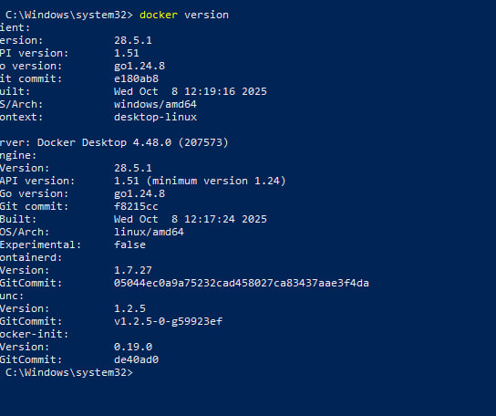

> Готовые образы берутся из сторонних источников: **Docker Hub** или другие

[Ссылка на Docker Hub](https://hub.docker.com/)

### Подготовка Docker (чтобы начать работать с "чистого листа")

1. Остановить все запущенные контейнеры
2. Удалить все остановленные контейнеры
3. Удалить все неиспользуемые образы

- Следует убедиться, нет ли у вас уже установленных и запущенных контейнеров:
```shell
docker ps -a
```
- Если есть, то лучше их остановить:
```shell
docker stop $(docker ps -q)
```
- Если остановленные контейнеры не нужны, то удалить их:
```shell
docker container prune
```
или
```shell
docker container prune $(docker ps -q)
```
- Ещё раз убедиться, что нет лишних контейнеров:
```shell
docker ps -a
```

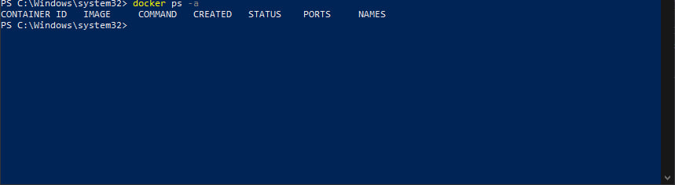

- Опционально можно удалить ненужные образы. Показать текущие образы:
```shell
docker images
```
Удалить все ненужные образы
```shell
docker image prune -a
```
или
```shell
docker rmi $(docker images -q)
```

> Удалять нужно только учебные контейнеры и образы, т.к. есть риск потерять важные данные, которые могут содержаться в контейнерах!

### Получение готового образа WelcomeToDocker

1. Поиск и получение готового образа на Docker Hub
2. Создание и запуск контейнера из полученного образа
3. Проверка состояния приложения из Docker-контейнера
4. Управление контейнером

Найти нужный образ на **Docker Hub**
```shell
docker search welcome-to-docker
```

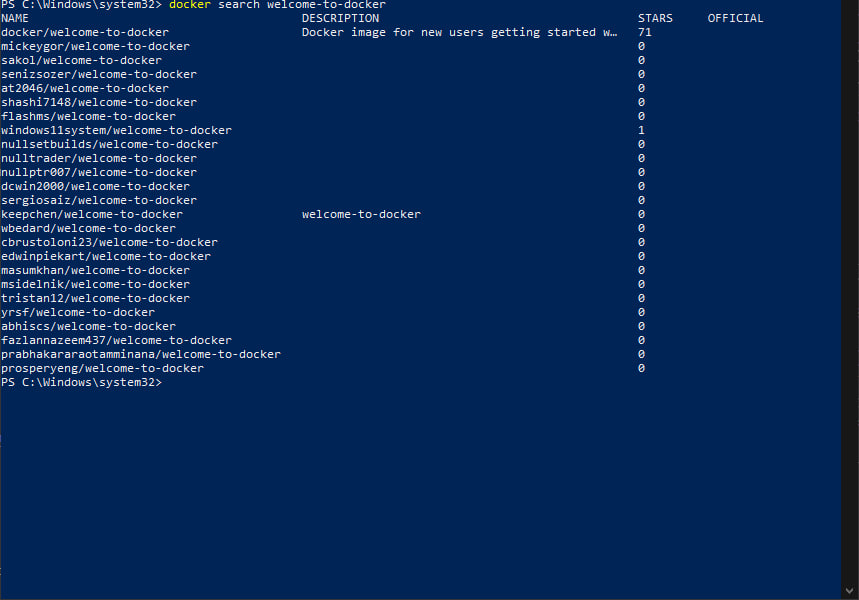

Получить, создать и запустить контейнер с WelcomeToDocker
```shell
docker run -d --name my-welcome -p 80:80 docker/welcome-to-docker
```

Если запуск контейнера не удался, то проверьте уже созданные контейнеры с таким именем у себя
```shell
docker ps -a
```

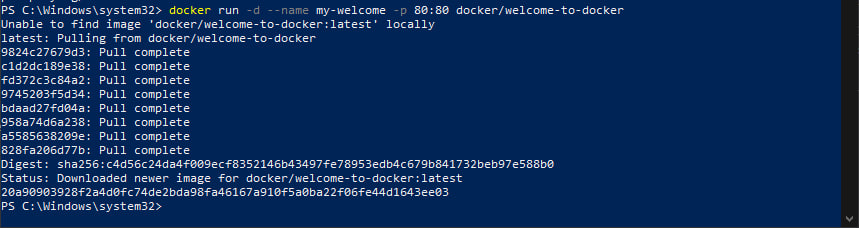

Показать загруженный на ваш компьютер образ
```shell
docker images
```

Если нужно только получить готовый образ, без создания и запуска контейнера, то
```shell
docker pull docker/welcome-to-docker
```

Получить информацию по загруженному образу:
```shell
docker inspect docker/welcome-to-docker
```

При необходимости остановить контейнер с таким именем:
```shell
docker stop my-welcome
```
Перезапустить контейнер по имени
```shell
docker restart my-welcome
```
Перезапустить контейнер по его **id**
```shell
docker restart 2e6c42d9b6af
```

Удалить выбранный контейнер по его имени
```shell
docker rm my-welcome
```

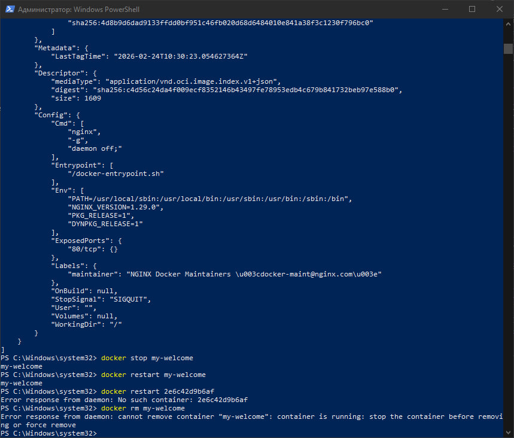

И можно удалить ещё и образ загруженного ранее WelcomeToDocker:

Получить id образа
```shell
docker images
```

Удалить по `id` нужный образ
```shell
docker rmi 062a783918fb
```

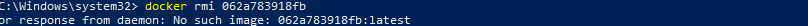

### Проверить работу контейнера

Можно снова установить и запустить WelcomeToDocker (если его удаляли ранее)
```shell
docker run -d --name my-welcome -p 80:80 docker/welcome-to-docker
```

Показать наличие загруженного файла образа
```shell
docker images
```

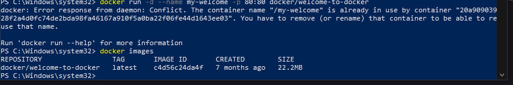

Показать только запущенные контейнеры
```shell
docker ps
```
или показать все контейнеры (в т.ч. остановленные)
```shell
docker ps -a
```
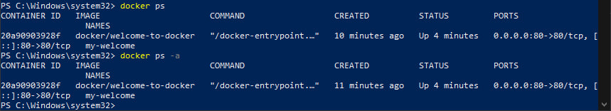

> Из одного образа можно получить несколько контейнеров!

Показать работающий WelcomeToDocker

Способ 1
```shell
curl http://localhost/
```

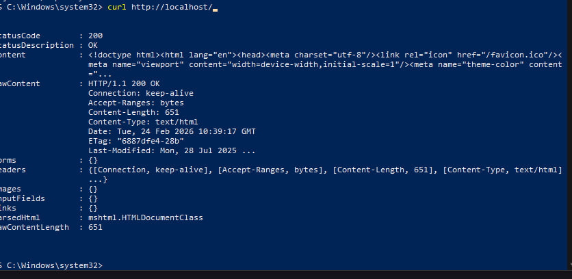

Способ 2 - [открыть http://localhost/ адрес в браузере](http://localhost/)


### Управление контейнером

#### Мониторинг контейнеров

Показать состояние всех контейнеров
```shell
docker ps -a
```

Показать подробности о контейнере
```shell
docker inspect my-welcome
```

Запустить мониторинг контейнеров
```shell
docker stats
```

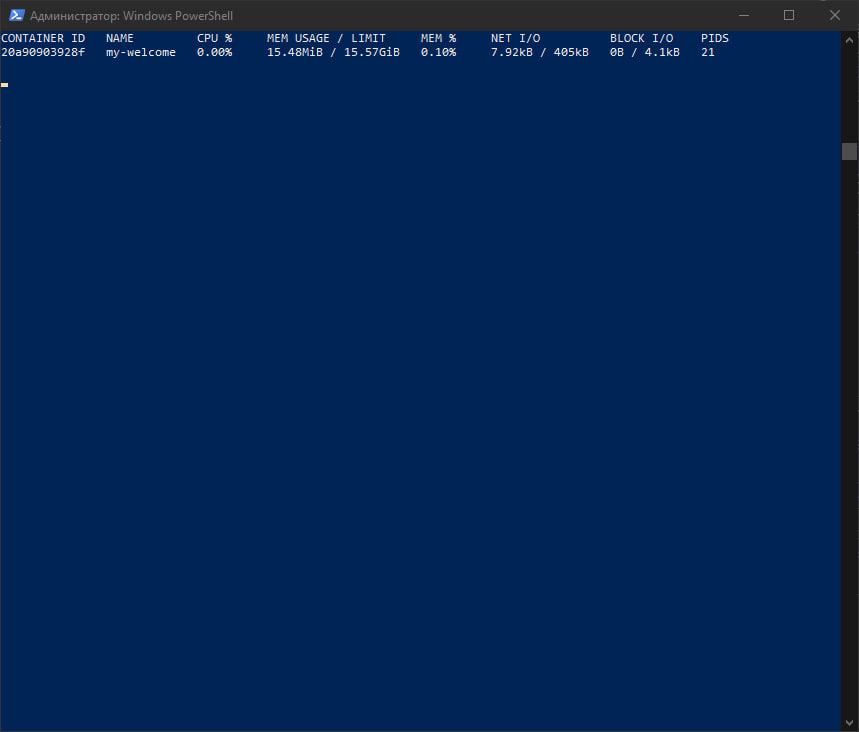

> Выйти из мониторинга контейнеров можно по `Ctrl+C`

Получить лог контейнера
```shell
docker logs my-welcome
```

Показать логи в режиме ожидания
```shell
docker logs -f my-welcome
```
> Выйти из логов в режиме ожидания можно по `Ctrl+C`

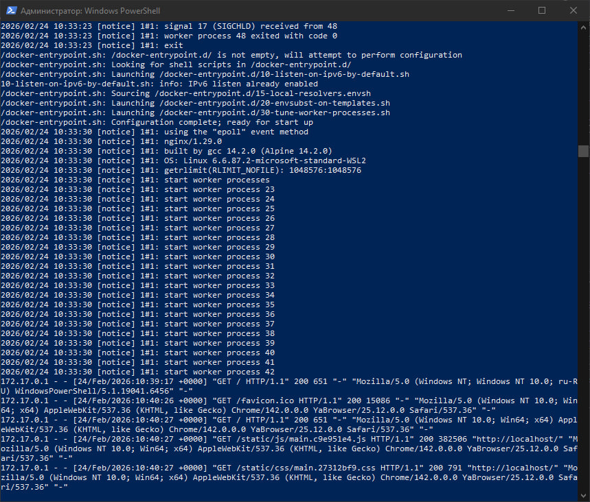

### Управление контейнером

Остановить контейнер
```shell
docker stop my-welcome
```

Снова запустить контейнер
```shell
docker start my-welcome
```

Перезапустить контейнер
```shell
docker restart my-welcome
```

Зайти в контейнер
```shell
docker exec -it my-welcome /bin/bash
```
или
```shell
docker exec -it my-welcome bash
```
или
```shell
docker exec -it my-welcome /bin/sh
```
или
```shell
docker exec -it my-welcome sh
```

внутри контейнера можно повыполнять некоторые команды Linux
Получить информацию об ОС контейнера
```shell
uname -a
```
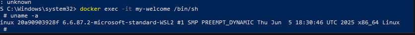

Получить больше информации об ОС контейнера
```shell
cat /etc/os-release
```


### Остановка и удаление всего

Остановить все запущенные контейнеры
```shell
docker stop $(docker ps -q)
```

Удалить все остановленные контейнеры
```shell
docker container prune
```

Удалить все образы (осторожно!)
```shell
docker rmi $(docker images -q)
```
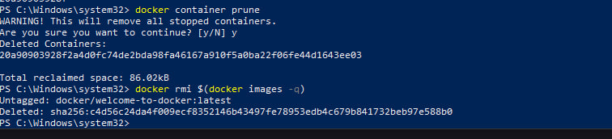
Теперь вы познакомились с основами работы с Docker на примере образа WelcomeToDocker и можете самостоятельно экспериментировать с другими образами!